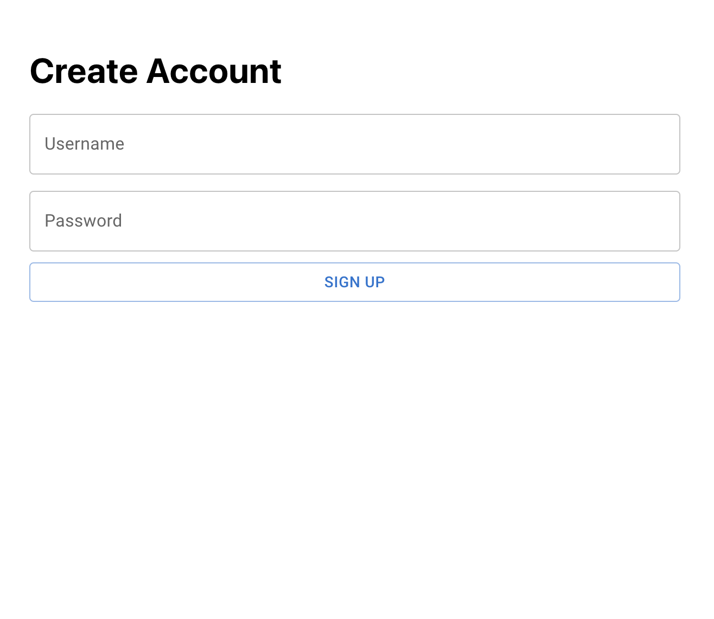
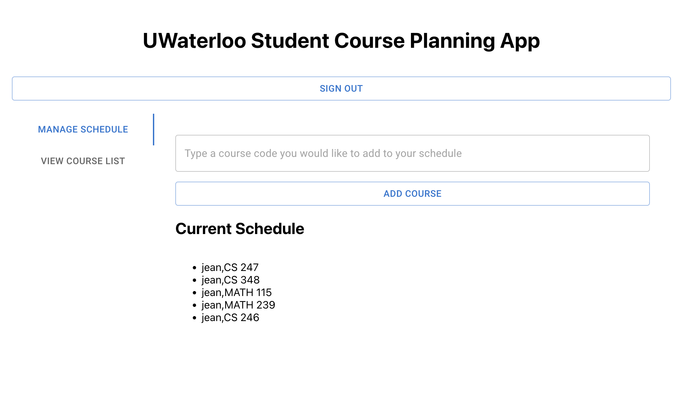

## Getting Started
### How to load the dataset

run `python populate_db.py`

This script will use UWaterloo's OpenData API to query the course offerings and information. It will use that data and create and populate the appropriate tables in our database.

### Installations
In main project directory, run: `pip install djangorestframework django-cors-headers`

Then, in the terminal type: `cd frontend/frontend` and run:
    `npm install axios`
    `npm install react-scripts`
    

### How to run the application
- cd into backend and run:
    `python manage.py runserver`

- In a new terminal, cd frontend/frontend and run:
    `npm start`

## List of Implemented Features

The following features have been implemented for Milestone 2.

1. Login/Sign in (Milestone 2)

The implementation of these features are located in:
- frontend/frontend/src/components/SignIn.jsx
- frontend/frontend/src/components/SignUp.jsx

2. Manage user schedule (Milestone 2)

The implemention of this feature is located in:
- frontend/frontend/src/components/HomePage.jsx

3. View Course List (Milesone 2)

The implementation of this feature is located in:
- frontend/frontend/src/components/HomePage.jsx